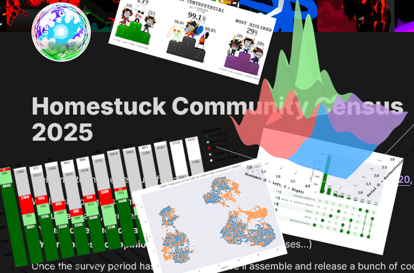

# Homestuck Community Census 2025



Repository for the **[Homestuck Community Census 2025](https://homestuck.net/meta/homestuck-community-census-2025/)**. This project contains the code used to calculate and visualize responses from a large-scale fandom survey run from March 1st to March 31st, 2025. The survey was designed to gather demographic information, fandom engagement, and opinions on various topics related to the Homestuck webcomic and its community.

The results in their original form have been held back to preserve anonymity, but this includes usable subsets of the data for your own analyses.

## Contents

```
answer_csvs/      # Raw per-question answer dumps (anonymized, one CSV per column)
result_csvs/      # Count + percentage summaries for each column (with low-count values grouped as "Other")
graphs/           # Exported visual charts (bar plots, pie charts, timelines, word clouds, etc.)
stats/            # Column variable correlations in csv format
variable_analysis.ipynb # Notebook handling variable reduction, clustering, embedding
visuals.ipynb           # Main visualization and graphing notebook
```

## Usage

If you'd like to:

- See the results in an accessible form: visit https://homestuck.net/meta/homestuck-community-census-2025/
- See how often specific identities, traits, or opinions appeared: check `result_csvs/`
- View all written answers for a column: check `answer_csvs/`
- See charts for a variable: open `visuals.ipynb`
- Continue our statistical analysis: open `variable_analysis.ipynb`

## Reproducibility

All outputs are generated from `census_results.csv` using `visuals.ipynb` and `variable_analysis.ipynb`. While the original data is not included, you can theoretically rebuild every single graph and statistic from the raw data, just not the by-row correlations. For that purpose `stats` contains correlation matrices. Original data is available upon request, but it better be good.